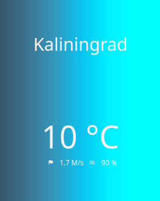

# Weather-Report-Extention
Simple extention on javascript  for chrome

#How to Setup
- Generate [OpenWeatherMap api](https://openweathermap.org/)
- Insert api key in ``` let api_key = "" ```
- Activate Developer Mode in Chrome

#Screenshot
